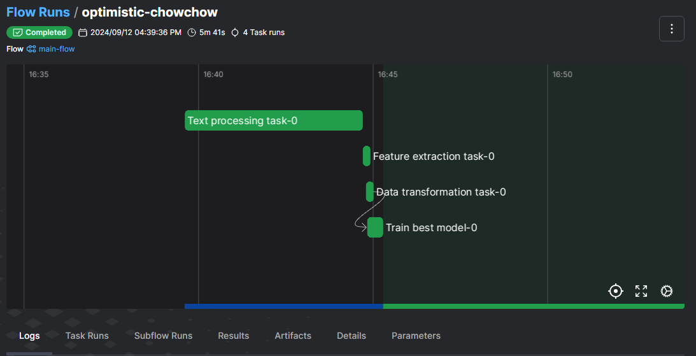

El objetivo sera implementar un pipeline que implemente la Clasificacion de ticket.

En el archivo `config.py` setearemos la configuración del pipeline como ser la ruta de donde se encuentra la data, la configuración de los modelos (esto es sacado de lo trabajado en [Tracking](..\tracking\tracking_data_tickets_baseline.ipynb)), el diccionario (cuando trabajamos la data)

El modelo con sus parámetros, voy a utilizar uno de los de mayor precision que obtuve en el tracking (el LogisticRegression voy a utilizar)

En el archivo `utils.py` hay métodos auxiliares. Se define un método para transformar las labels en los id y los métodos para cargar y guardar los pickle (empaquetado de información)

También se cargaran los módulos para el procesamiento de texto `feature_extraction` y `text_processing`, trabajados en [utils (general)](..\utils\readme.md)(se copia la carpeta util y se coloca aca adentro, para no repetir se coloco dentro del gitignore)

El archivo `orchestrate_with_prefect.py` es donde se definen las task y el flow de trabajo:

- Task que se encarga del procesamiento del texto, repitiendo lo analizado en [utils (general)](..\utils\readme.md), transformara el json en un .csv, donde tendremos el contenido de lo que ha pasado, la clasificación del ticket y el texto procesado (tokens)

```python
@task(retries=3, retry_delay_seconds=2,...
def text_processing_task(...
```


- Task que tomara el texto procesado y lo clasificara en temas, también analizado en [utils (general)](..\utils\readme.md)

```python
@task(retries=3, retry_delay_seconds=2,...
def feature_extraction_task(data_path_processed: str, 
```


- Task que separa la data en train y en test 

```python
@task(retries=3, retry_delay_seconds=2,...
def data_transformation_task_and_split(...
```


- Task que entrena el modelo

```python
@task(retries=3, retry_delay_seconds=2,...
def training_best_model(...
```

Para las 4 task se utilizo el decorador `@task` y se definieron los parámetros de cantidad de intentos, tiempo entre intensos y etiquetas. 

Por ultimo se definió el flow, utilizando el decorador `@flow` el cual utiliza las task definidas previamente:

```python
@flow
def main_flow():
```

### Ejecución

Primero es necesario tener abierto el servidor de prefect en una consola aparte: 
`prefect server start`

Luego ejecutamos el archivo de la orquestación:

`python orquestacion\orchestrate_with_prefect.py`

Desde la consola de prefect se puede seguir la ejecución del flow en tiempo real

Finalizado el flow tendremos en la consola la siguiente salida:


Donde se verán las métricas del modelo entrenado.

Si vamos a la consola del prefect veremos, en la pestaña `flows` los flujos ejecutados:


En este caso se puede ver el iris-classification, el cual se ejecuto en [introduccion al prefect](.//introduction/readme.md) y esta corrida (main-flow)

si vamos a la pestaña `flows runs` veremos las corridas dentro de la escala de tiempo especificada:


En verde sera las corridas que se ejecutaron con éxito, en rojo las que fallaron (ejecutadas durante la confección del flow) y en azul aparecerán las que están en ejecución

Al hacer click en uno de los flow tendremos el detalle, veremos las corridas del mismo:


La misma idea, en rojo las que fallaron y en verde las que tuvieron éxito. 

Si clickeamos en una corrida tendremos los detalles de la misma:



Donde veremos las task que se ejecutaron y el orden. Para este caso las 4 task ocurrieron en serie pero pueden ocurrir task en paralelo. Ademas podre consultar los `log` emitidos durante las corridas, ver los `subflows`, los `artefactos` generados, los a `parámetros`, etc.

Tomando por ejemplo la pestaña `task`, veremos los tag de las mimas: 


