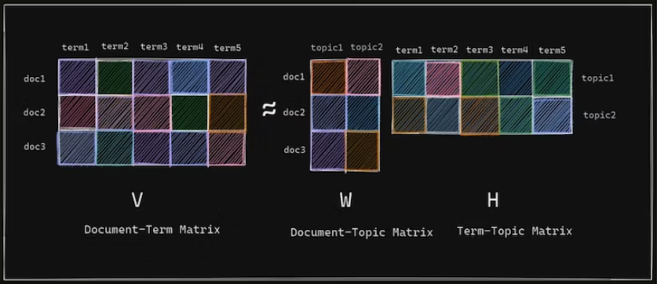

Aca encontraremos dos funciones que se encargarán del procesamiento del texto y de la extracción de características

La data sin procesar se encontrara en un .json. Ejemplo de un ticket:
```json
{
        "_id": "3229299",
        "_index": "complaint-public-v2",
        "_score": 0.0,
        "_source": {
            "company": "JPMORGAN CHASE & CO.",
            "company_public_response": null,
            "company_response": "Closed with explanation",
            "complaint_id": "3229299",
            "complaint_what_happened": "Good morning my name is XXXX XXXX and I appreciate it if you could help me put a stop to Chase Bank cardmember services. \nIn 2018 I wrote to Chase asking for debt verification and what they sent me a statement which is not acceptable. I am asking the bank to validate the debt. Instead I been receiving mail every month from them attempting to collect a debt. \nI have a right to know this information as a consumer. \n\nChase account # XXXX XXXX XXXX XXXX Thanks in advance for your help.",
            "consumer_consent_provided": "Consent provided",
            "consumer_disputed": "N/A",
            "date_received": "2019-05-01T12:00:00-05:00",
            "date_sent_to_company": "2019-05-01T12:00:00-05:00",
            "issue": "Written notification about debt",
            "product": "Debt collection",
            "state": "GA",
            "sub_issue": "Didn't receive enough information to verify debt",
            "sub_product": "Credit card debt",
            "submitted_via": "Web",
            "tags": "Servicemember",
            "timely": "Yes",
            "zip_code": "319XX"
        },
        "_type": "complaint"
    }
```
Y se transformara a un .csv, donde tendremos el contenido de lo que ha pasado, la clasificación del ticket y el texto procesado (tokens) es el que aparece en el ultimo campo:

```csv
"Good morning my name is XXXX XXXX and I appreciate it if you could help me put a stop to Chase Bank cardmember services. In 2018 I wrote to Chase asking for debt verification and what they sent me a statement which is not acceptable. I am asking the bank to validate the debt. Instead I been receiving mail every month from them attempting to collect a debt. I have a right to know this information as a consumer. Chase account # XXXX XXXX XXXX XXXX Thanks in advance for your help.",

Debt collection + Credit card debt,

morn name appreci chase bank cardmemb servic chase debt verif statement accept bank debt mail month attempt debt right inform consum chase account advanc help
```

El primer archivo a ejecutar es el `textprocessing.py` el cual procesara el texto, realizando:

**- Tokenización:**  Es el proceso de convertir las secuencias de caracteres, oraciones o párrafos en inputs que puedan ser procesados, en este caso palabras sueltas. 

**- Eliminación de stopwords:** consiste en omitir o eliminar palabras redundantes, que no contribuyen en gran medida a entender el texto. Las stopwords carecen de sentido cuando se escriben solas o sin la palabra clave o keyword, como ejemplo están las conjunciones, artículos, preposiciones y adverbios.
    
**- Lematización:** relaciona una palabra flexionada o derivada, es decir, en plural, en femenino, conjugada, etc. con su forma canónica o lema, forma que por convenio se acepta como representante de todas las formas. Por ejemplo: `decir` es el lema de `dije`, `diré` o `dijéramos`, `guapo` es el lema de `guapas`, `mesa` es el lema de `mesas`.

**- Etiquetado POS:** consiste en asociar cada palabra de una frase con su posición en la oración. Alguno de los tag usados son: Sustantivo, Verbo, Pronombre, Preposición, Adverbio, Conjunción, Adjetivo, Artículo


Este archivo utiliza la librería nltk, que posee todas la herramientas antes descritas, para el procesamiento de texto


**NOTA:** Es necesario realizar `python -m nltk.downloader stopwords` y `python -m nltk.downloader punkt` luego de la instalación del paquete nltk mediante pip, para la descarga de los paquetes complementarios


Si analizamos paso a paso el procesamiento del texto de ejemplo veremos

**- Tokenización:**                   
`['good', 'morning', 'my', 'name', 'is', 'xxxx', 'xxxx', 'and', 'i', 'appreciate', 'it', 'if', 'you', 'could', 'help', 'me', 'put', 'a', 'stop', 'to', 'chase', 'bank', 'cardmember', 'services', '.', 'in', '2018', 'i', 'wrote', 'to', 'chase', 'asking', 'for', 'debt', 'verification', 'and', 'what', 'they', 'sent', 'me', 'a', 'statement', 'which', 'is', 'not', 'acceptable', '.', 'i', 'am', 'asking', 'the', 'bank', 'to', 'validate', 'the', 'debt', '.', 'instead', 'i', 'been', 'receiving', 'mail', 'every', 'month', 'from', 'them', 'attempting', 'to', 'collect', 'a', 'debt', '.', 'i', 'have', 'a', 'right', 'to', 'know', 'this', 'information', 'as', 'a', 'consumer', '.', 'chase', 'account', '#', 'xxxx', 'xxxx', 'xxxx', 'xxxx', 'thanks', 'in', 'advance', 'for', 'your', 'help', '.']`

Vemos que tomo la frase y devolvió un array de las palabras suelta:


**- Eliminación de stopwords:**
`['good', 'morning', 'name', 'xxxx', 'xxxx', 'appreciate', 'could', 'help', 'put', 'stop', 'chase', 'bank', 'cardmember', 'services', '.', '2018', 'wrote', 'chase', 'asking', 'debt', 'verification', 'sent', 'statement', 'acceptable', '.', 'asking', 'bank', 'validate', 'debt', '.', 'instead', 'receiving', 'mail', 'every', 'month', 'attempting', 'collect', 'debt', '.', 'right', 'know', 'information', 'consumer', '.', 'chase', 'account', '#', 'xxxx', 'xxxx', 'xxxx', 'xxxx', 'thanks', 'advance', 'help', '.']`

Elimino palabras como `my` o `is`


**- Lematización:**  
`['good', 'morn', 'name', 'xxxx', 'xxxx', 'appreci', 'could', 'help', 'put', 'stop', 'chase', 'bank', 'cardmemb', 'servic', '.', '2018', 'wrote', 'chase', 'ask', 'debt', 'verif', 'sent', 'statement', 'accept', '.', 'ask', 'bank', 'valid', 'debt', '.', 'instead', 'receiv', 'mail', 'everi', 'month', 'attempt', 'collect', 'debt', '.', 'right', 'know', 'inform', 'consum', '.', 'chase', 'account', '#', 'xxxx', 'xxxx', 'xxxx', 'xxxx', 'thank', 'advanc', 'help', '.'] `      

Miremos el caso de `morning`, que se queda solo con la raíz `morn`; o el caso de `validate`que se queda con la raíz `valid`


**- Etiquetado POS:**
`'morn name appreci chase bank cardmemb servic chase debt verif statement accept bank debt mail month attempt debt right inform consum chase account advanc help'`

A diferencia de lo explicado anteriormente, aca se utiliza el etiquetado POS para filtrar y quedarse solo con los sustantivos, ademas de que transforma el array en un string. El archivo de salida sera `data/data_procesada/tickets_classification_eng_1.csv`


El segundo archivo a ejecutar es el `feature_extraction.py` el cual tomara el texto procesado y lo clasificara en temas, para ello utiliza dos herramientas de scikit-learn:

**- TfidfVectorizer:** es una medida que expresa lo relevante que es una palabra en un documento, teniendo en cuenta el número de veces que aparece esa palabra (o token) en dicho documento y  su presencia en el corpus, para este caso los documentos serian los tickets mientras que el corpus es la totalidad de estos. De forma muy general, un término que aparece con frecuencia en un documento en particular, y rara vez en todo el corpus, tendrá una puntuación IDF más alta, ya que se considerara que esa palabra importante y representativa de ese documento.

**- NMF (Factorización de matrices no negativas):** 

El TfidfVectorizer generara la Matriz Término-Documento como la siguiente:

| #       | bank   |credit |loan  |money |
| ---     | ---    |---    |---   |----- |
|ticket_0 | 0.162  |0  	   |0  	  |0     |
|ticket_2 | 0  	   |0.133  |0  	  |0     |
|ticket_3 | 0.101  |0.208  |0  	  |0     |
|ticket_4 | 0.148  |0  	   |0  	  |0.307 |
|ticket_6 | 0.125  |0  	   |0  	  |0     |
|ticket_7 | 0  	   |0  	   |0.132 |0     |
|ticket_8 | 0.148  |0  	   |0  	  |0.034 |
|ticket_9 | 0      |0.465  |0	  |0     |

En este caso se muestra para los primeros 8 ticket, que tan relevante son los términos bank, credit, loan y money, a mayor valor, mayor sera la relevancia de ese termino en ese ticket.

La Factorización de Matriz no negativa actúa sobre esta matriz, descomponiendola de la siguiente manera:




La matriz W , que se denomina matriz documento-tema. Esta matriz muestra la distribución de los temas en los documentos del corpus.

La matriz H , que también se denomina matriz término-tema. Esta matriz captura la importancia de los términos en los temas.

NMF inicializara dos matrices W y H aleatorias, con la cantidad de temas que le indiquemos, y el algoritmo se ejecutara iterativamente hasta que encuentre W y H que minimizan la función de costo.

La matriz que nos interesa, en este ejemplo, es la matriz documento-tema, la cual usaremos para definir a que tema pertenece cada ticket. 

| #       |topic0  |topic1  |topic2  |relevant_topics|
| ---     | ---    |---     |---     |-----          |
|ticket_0 |   0.03 |   0.01 |   0.02 |            0  |
|ticket_1 |   0.01 |   0.02 |   0.00 |            1  |
|ticket_2 |   0.00 |   0.06 |   0.00 |            1  |
|ticket_3 |   0.02 |   0.07 |   0.01 |            1  |

La matriz documento-tema es la que se muestra arriba (con el agregado de la columna final), a mayor valor mayor sera la posibilidad de que el ticket pertenezca al tema, con esto, se definió la pertenencia del ticket y se agrego la ultima columna indicando a que tema  pertenecen.

Para que no sea tan abstracto se indico un nombre a cada tema (Topic), en función a los términos que engloba:

**- Topic 0 "Bank Account Services":** account, bank, check, money, chase, deposit, fund, day, claim, fee, branch, call, transact, number, charg

**- Topic 1 "Credit Report or Prepaid Card":** credit, card, report, chase, inquiri, charg, account, disput, compani, score, letter, author, fraud, inform, us

**- Topic 2 "Mortgage/Loan":** payment, loan, chase, mortgag, month, home, interest, time, pay, year, modif, rate, amount, fee, letter

Por ultimo, luego de ejecutar ambos archivos, tendremos en la carpeta de data procesada 3 archivos:

**- tickets_classification_eng_1.csv:** Es el generado por el textprocessing.py y que contiene el contenido del ticket, la clasificación del ticket y el texto procesado (tokens) 

**- tickets_inputs_eng_1.csv":** Es el generado por el feature_extraction.py, idéntico al anterior pero con el agregado de la ultima columna indicando el tema relevante (como un int)

**- topic_mapping_1.json":** También fue generado por el feature_extraction.py e indica el mapeo de los temas (indica el titulo del tema según su numero)

---

<sub>
Nota extra:
Otros métodos que se pueden aplicar para el procesamiento del texto son:

Stemming: relaciona los afijos de las palabras para obtener la raíz de la palabra, por ejemplo, going se convierte en go.

Bolsa de palabras: una oración se considera como un conjunto de palabras, sin tener en cuenta la gramática ni el orden de las palabras.

N-gramas: son una secuencia continua de palabras adyacentes en una oración, necesarias para obtener el significado correctamente, por ejemplo, machine learning es un bigrama.

TF (frecuencia del término): es el número de veces que aparece una palabra en un mensaje o una oración; indica la importancia de esa palabra.

Reconocimiento de entidades nombradas: identifica y etiqueta palabras que representan entidades de palabras reales, como personas, organizaciones, lugares, fechas, etc.
</sub>